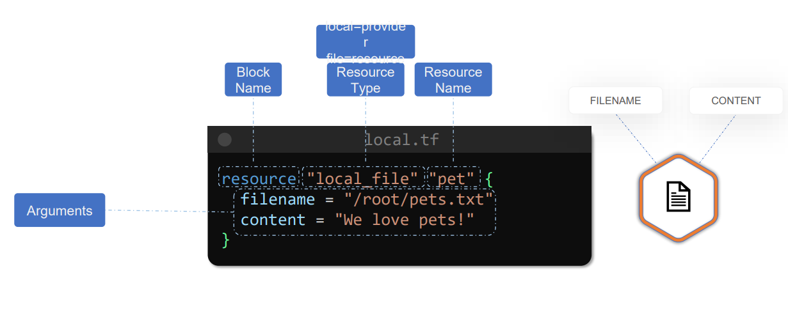
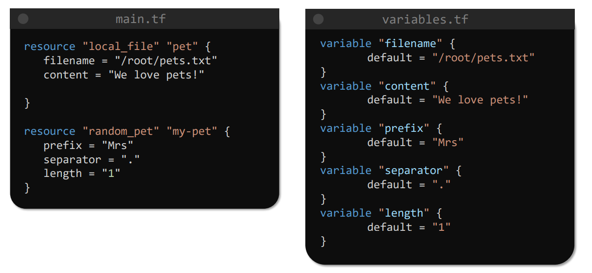
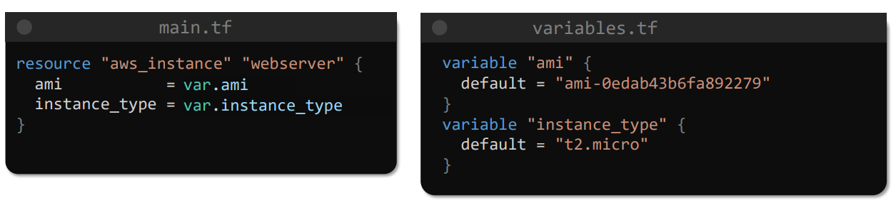
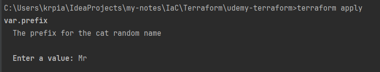

# Terraform


## Terms

# 3
Terraform uses specific HCL language which is defined in a specific blocks



To check resource providers we have to check the documentation page,
there is no way by command line to check it explicitly.
But the most known are:
- aws (aws_instance, aws_s3_bucket, aws_vpc)
- local (local_file, local_directory)
- kubernetes (kubernetes_pod, kubernetes_service)
- azure (azurerm_virtual_machine)

## Stages ofd using terraform in a project:

```bash
    #Create a .tf file
    terraform init 
    terraform plan #Actions that will be carried 
    terraform apply #Carrying this changes/actions
```

> terraform init dziala tylko jak w naszym katalogu znajduja sie pliki *.tf i glownym jego zadaniem jest tworzenie backendu (czyli gdzie beda przychowywane pliki .state)

This message occurs if we dont have any *.tf files inside a dir
```bash
│ Error: No configuration files
│
│ The directory C:\Users\krpia\IdeaProjects\my-notes\IaC\Terraform\udemy-terraform contains no Terraform configuration files.
```


To check if the provider is original (made by HashiCorp or official partner such as aws or azure)
or from 3rd party provider, we have distinguish following:
> hashicorp/aws - official partners from hashicorp
> third-party/namespace/provider - for 3rd parties


### whenever we add a resource for a provider that has not been used so far in the configuration directory, we have to initialize the directory by running terraform init command.

## Variables

We can define variables in terraform that are used to implement DRY
programming pattern. We can now have the variables specified to create
resources based on this predifined variables.


- here is the basic example


- here is the real-world scenario with using this feature with aws.
  

Variables a MUST-declared thing is the default inside the block, but
we can declare some other fields which are optional but pretty good to 
have to ensure a type for example and provide a decription to know 
what are we doing it for:
```
variable "aws_ami" {
    default = "ami-asdfai2314asd123"
    type = string
    description = "Ami image used here is Ubuntu LTS 20.21 and its eu-west based"
}
```


### Variable types:

#### List - the same data inside
```
variable "prefix" {
    type = list(string)
    default = ["Mr", "Mrs", "Sir"]
}


#To use it:
resource "random_pet" "random_name"{
    prefix = var.prefix[0]
    separator = "."
    length = 1
}

```


#### Tuple - can contain multiple data - numbers and string in the same 'list'
```
variable "kitty" {
    type = tuple([string, number, bool])
    default = ["cat", 7, true]
}
```

#### Map
```
variable "full_names" {
    type = map(string)
    default = {
        "Kacper" = "Piasecki"
        "Jedrek" = "Jedrzejny"
}

# To use it:

resource "local_file" "my-surname"{
    filename = "my_surname.txt"
    content = var.full_names["Kacper"]
}
```


#### Object - we can create our own data structure holding stuff
```
variable "bella" {
    type = object ({
        name = string
        surname = string
        fav_meal = string
        age = number
    
    })
    
    default = {
        name = "Kacper"
        surname = "Piach"
        fav_meal = "wodeczka"
        age = 7
    }
}
```


Sometimes we can define a variable without a default value that should be used.
Then either we can run terraform apply command and we will see
that terraform asks us what do we want to do with it:



Or we can use other features to provide it explicitly:
- .tfvars file where we specify the correct options:
myvars.tfvars
```
  prefix = "Mr"
  version = "17"
```
and then we have to type:
> terraform apply -var-file myvars.tfvars

- env values(THEY HAVE TO BE SPECIFIED IN TF_VAR_<name> format) 
> export TF_VAR_filename="/root/cats"


- by -var flag with terraform apply/plan command
> terraform apply -var "filename=/root/cats"


## ALE NAJLEPIEJ ZAWSZE MIEC DEFAULTOWO WARTOSCI USTAWIONE, A JAK COS TO PO PROSTU NADPISYWAC JE w tfvars pliku!


# Resource attributes

Sometimes we might want to use the output of some resource to be used
in creation of the other one. For that we have to check what 
the 1st resource is returning. How this variable that is returned is called
and what type it is.
```
  resource "local_file" "my_file" {
      filename = var.filename
      content = "My favourite cat name is: ${random_pet.my-pet.id}"
  }
  
  resource "random_pet" "my-pet" {
      prefix = var.prefix
      length = var.length
      separator = var.separator
  }
  
  whereas the variables.tf file looked like:
  
  variable "prefix" {
    default = "Mr"
  }
  
   variable "length" {
    default = 1
  }
  
  variable "filename" {
    default = myfile.txt
  }
  
  variable "separator" {
    default = "."
  }
  
```


### terraform show - prints current config and information about the resources created (and outputs too)


We can declare implicitly that one resource is dependant on different one:
```
resource "local_file" "my_file" {
  filename = var.filename
  content = "My favourite cat name is: ${random_pet.my-pet.id}"
  depends_on = [ random_pet.my-pet ]
}
```

We can declare as well sth called - 'output'. This feature allows us to print some message on the CLI after the creation of resources:
The must have thing that have to be here specified is the value option.


```
output "my-output" {
    value = aws_instance.server.private_ip
}

output "my-output-3" {
    value = local_file.my-file.content
}
```
