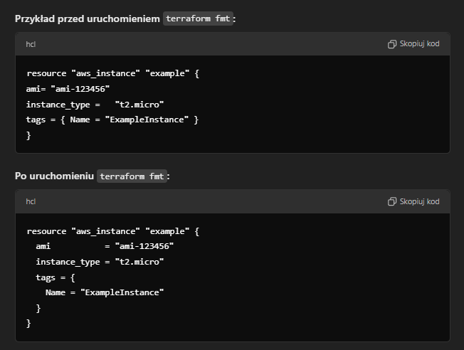
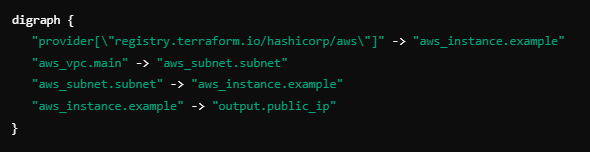
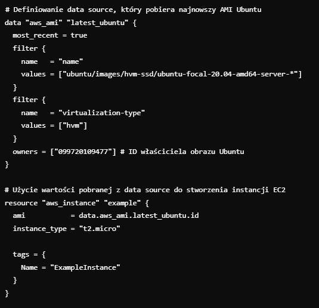
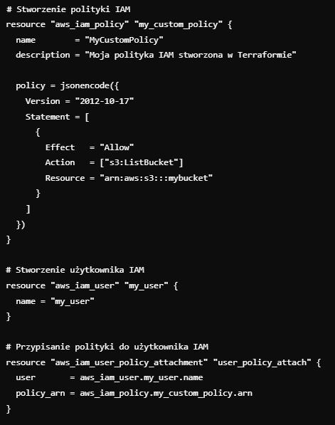

# Terraform Section 5

> Co to jest terraform.tfstate?

Plik stanu Terraform, czyli terraform.tfstate, to kluczowy element w ekosystemie Terraform, który przechowuje aktualny stan zarządzanej infrastruktury. Terraform używa tego pliku, aby śledzić, jak wygląda faktyczna infrastruktura (zasoby, ich atrybuty) w porównaniu do tego, co jest opisane w plikach konfiguracyjnych (.tf). Dzięki temu Terraform może określić, jakie zmiany należy wprowadzić podczas wykonywania komend takich jak terraform plan i terraform apply.

Pozwala on nam zmieniac tylko poszczegolne pliki, a nie reloadowac cala konfiguracje na raz.
Jezeli dokonujemy zmian w pliku i bedziemy chcieli je wcielic w zycie,
to za pomoca komendy terraform apply USUNIEMY poprzedni resource i podmienimy go nowym
Z NOWYM ID i z nowa wczesniej juz przez nas zdefiniowana konfiguracja
state file posiada rowniez metadane z danych plikow


> Po co uzywac pliku state

Kiedy pracujemy w zespołach, zdalne przechowywanie stanu (remote state) zapewnia, że wszyscy członkowie zespołu mają dostęp do tej samej, aktualnej wersji stanu, co zapobiega niezgodnościom.


Problemy związane z plikiem stanu:
Jeśli wiele osób lub procesów próbuje jednocześnie zmieniać stan infrastruktury, mogą wystąpić konflikty. Dlatego zdalne przechowywanie stanu z mechanizmem blokowania (np. w S3 z DynamoDB) jest często zalecane.


### Terraform state file: terraform.tfstate IS NOT CREATED UNTIL we run terraform apply command 


# Terraform Section 5 - Working with terraform
> I will present simple commands and features that are used here in terraform


1) terraform fmt:
Komenda terraform fmt w Terraformie służy do automatycznego formatowania plików konfiguracyjnych w celu zapewnienia spójnego stylu kodu.
Polecenie to przekształca pliki .tf oraz inne pliki związane z Terraformem (np. *.tfvars),
zgodnie z ustalonym stylem formatowania, co ułatwia ich czytelność i współpracę w zespołach.

```bash
    terraform fmt   #Prints in what files the changes were made
```



2) terraform validate:

```bash
    terraform validate   # Checks if the syntax is correct
```


2) terraform show:

```bash
    terraform show   # Prints essential information about our resource
```

3) terraform sprovidershow:

```bash
    terraform providers   # Prints the providers downloaded since entering the terraform init command
```


4) ## This is very important command! I had faced issues in the 1st tutorial where I deleted some resources in aws manually and then i faced issues because of not refreshing the state here
```bash
    terraform refresh   # Refreshes the state in our directory in case the changes were made OUTSIDE THE DIRECTORY HERE
```


5) terraform graph: Uzywany po to zeby zobaczyc jak resource sa powiazane ze soba:


aws_instance.example jest zalezne od aws od aws_subnet.subnet
aws_subnet.subnet jest zalezne od aws_vpc.main
```bash
    terraform graph   
```


## Mutable vs immutable terraform infrastructure
> When we run terafform apply command we destroy the current configuration and implement a new one

Mutable infrastructure to podejście, w którym zasoby (np. serwery, maszyny wirtualne, bazy danych) mogą być modyfikowane w trakcie ich życia.


Immutable infrastructure to podejście, w którym zasoby nigdy nie są modyfikowane po ich utworzeniu. Gdy potrzebna jest zmiana, Terraform tworzy nowe zasoby, a stare są niszczone


Ale mozemy sprawic zeby najpierw byly tworzone np. nowe zasoby a stare usuwany dopiero wtedy kiedy nowe zostana utworzone, albo zeby stare rzeczy nie byly usuwane w ogole!
Mozemy to zrobic za pomoca uzycia LifeCycle Rules.


```terraform
    resource "local_file" "pet" {
        filename = "/root/pets.txt"
        lifecycle {
          prevent_destroy = true
        }
}
```


```terraform
    resource "local_file" "pet" {
        filename = "/root/pets.txt"
        lifecycle {
          create_before_destroy = true
        }
}
```

```terraform
    resource "aws_instance" "pet" {
  ami           = "ami-asfhvgg23412-asdA"
  instance_type = "t3-micro"
      tags = {
          Name = "Project A - Webserver"
      }
      lifecycle {
          ignore_changes = [
            tags
      ]
  }
}
```


```terraform
    resource "aws_instance" "pet" {
      ami           = "ami-asfhvgg23412-asdA"
      instance_type = "t3-micro"
      tags = { 
          Name = "Project A - Webserver"
      }
      lifecycle {
          ignore_changes = all
  }
}
```


Fun fact: if we set the lifecycle rule on local_file as create before deleting we might face an issue of not having this file after all.
The filepath is unique such as /root/myfile.txt , so if we create the file first, we might just overwrite the 1st file that exists and then 
we destroy it so we dont have an access to it anymore!

## Data sources
> These are the external data from terraform that can be included into terraform state.


For example we have a file(outside of our terraform) that we would like to use inside some terraform resources.
Then we have to specify a data block which is used only for:
- reading (creating/updating/destroying is not part of it as it is in terraform RESOURCE)



- W bloku data "aws_ami" "latest_ubuntu", Terraform pobiera najnowszy AMI Ubuntu, który spełnia kryteria filtrów (nazwa obrazu, typ wirtualizacji).
- W bloku resource "aws_instance", instancja EC2 jest tworzona z użyciem obrazu AMI pobranego z data source (data.aws_ami.latest_ubuntu.id).


## Metadata arguments
> We have 2 very important ones: count && for_each that are used to create multiple resources.

1) count:
- treats our values as an array now and we can set it up by correct indexes:
- if we delete some values the whole list is being restructured so pretty often instead of changing 1 resource, we have to modify ALL resources
- if we create a resource by a count = 3, option THEN WE CREATE A LIST OF THIS RESOURCES

```terraform
    resource "local_file" "my_file"{
        filename = var.filenames[count.index]
        count = length(var.filenames)
}

    variable "filenames" {
      type = list(string)
      default = [ "pets.txt", "dogs.txt", "cats.txt" ]
    }

```

2) for_each:
- is used only with maps/sets and you can reference to the correct var by the key name
- prevents us from deleting more resources during modifications


```terraform
resource "local_file" "my_file"{
        filename = each.value
        for_each = toset(var.filenames)
}

variable "filenames" {
  type = listt(string)
  default = [ "pets.txt", "dogs.txt", "cats.txt" ]
}
```


## Version Constraints
> If we want to use a specific version of some resource provider, then we have to go to the documentation page and click the version
> And then include this piece of code in our main.tf file:

```terraform
terraform {
  required_providers {
    aws = {
      source = "hashicorp/aws"
      version = "5.66.0"
    }
  }
}
```

```terraform

terraform {
  required_providers {
    google = {
      source  = "hashicorp/google"
      version = "> 3.45.0, !=3.46.0, < 3.48.0" # != cannot be this version,  > 3.45 greater then this version and < 3.48.0 smaller than this version
    }
  }
}

```

Ale mamy jeszcze jedna opcje:
~> - Allows only the rightmost version component to increment. This format is referred to as the pessimistic constraint operator. For example, to allow new patch releases within a specific minor release, use the full version number:


# Section 7 - Terraform + AWS
>First we have to configure AWS with our project and the best way to do it is by: aws configure command in the CLI. This nadpisuje zmienne i je szyfruje w pliku /.aws/config/credentials


Then we can set up some default values for a provider like this: 
```terraform

terraform {
  required_providers {
    aws = {
      source  = "hashicorp/aws"
      version = "~> 5.0"
    }
  }
}

    provider "aws" {
      region = "us-east-1"
} 
```

## Creating IAM policies and assigning them to users




OR


we can use the file command that is available in terraform.
To do it we have to specify our json file in the same directory
as main.tf file, such as my-policy.json
and then specify:
```terraform
# Wczytanie polityki z pliku JSON
resource "aws_iam_policy" "my_custom_policy" {
  name        = "MyCustomPolicyFromFile"
  description = "Polityka IAM wczytana z pliku JSON"
  
  # Użycie funkcji file() do wczytania zawartości pliku JSON
  policy = file("my-policy.json")
}

# Stworzenie użytkownika IAM
resource "aws_iam_user" "my_user" {
  name = "my_user"
}

# Przypisanie polityki do użytkownika IAM
resource "aws_iam_user_policy_attachment" "user_policy_attach" {
  user       = aws_iam_user.my_user.name
  policy_arn = aws_iam_policy.my_custom_policy.arn
}

```


## AWS S3 with terraform

- s3 is a storage where we can store our files/videos/etc
- it is region oriented
- its name has to be unique because if it is created the DNS server is created and we can access this s3 bucket from a webpage by entering its server name in specific region
- its name would look like : https://<bucket_name>.<region>.amazonaws.com
- DNS server cannot have underscore so we cannot have names such as: my_bucket_1_2_3 because it ends up with error

How to add a file existing in our system to the newly created S3 bucket?

```terraform
resource "aws_s3_bucket" "examplebucket" {
  bucket = "examplebuckettftest"
}

resource "aws_s3_bucket_object" "example" {
  bucket                 = aws_s3_bucket.examplebucket.id
  key                    = "file.txt"
  source                 = "/root/home/file.txt"
}

```