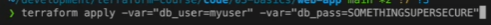
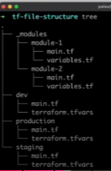

# Terraform


## Terms

# 1 
Terraform is a tool that is not tight-nit with some cloud provider,
that's why it is used, because once written configuration
can be used in different clouds.


> Terraform is a tool that is used to provision new things.


> Ansible is a tool for a management of already existing tools.


> Kubernetes

So, we can use Terraform to create new EC2 Instance and then
use Ansible to specify which OS system should be running 
under this EC2 instance for example. Or provisioning new
cluster's in the cloud and then manage and organize how
our pods are deployed by kubernetes


Terraform architecture
```bash

terraform state     <--->
                            Terraform Core   --->  CLOUD PROVIDER
terraform config    ---->

```

Process of setting up the terraform on your AWS

1) Create IAM User
2) `aws configure` in the right directory
3) `terraform init` 
4) `terraform plan` - checks current state of the resources
5) `terraform apply` - applies the commands specified
6) `terraform destroy` - cleaning resources after working with them


# PART 3

```bash
terraform {
  required_providers {
    aws = {
      source  = "hashicorp/aws"
      version = "~> 3.0"
    }
  }
}

#This piece of code is specified at the beginning with the 
#cloud provider we are going to use and below we can specify 
#the settings for this cloud provider such as

provider "aws" {
  region = "eu-central-1"
}
```

3) 
But very important aspect:
After terraform init we create this tree structure:

```bash
└───.terraform
    └───providers
        └───registry.terraform.io
            └───hashicorp
                └───aws
                    └───3.76.1
                        └───windows_386
└───.terraform.lock.hcl
└───.main.tf
```

And every after apply the state file is being created that is a representation
of infomations about our every resource that was deployed by terraform

In this state file there are sensitive data too, so we have to encrypt it 
and provide right permissions to the certain users

Normally state file is stored locally in our working directory,
but a better practice is to store is in the cloud - in an S3 instance
for example, to provide there encryption, make it available to the other
engineers too and make it available for some type of automatation by GithubActions


But this process is a little bit tricky.
We have to apply this changes first only locally so with:


backend "s3" {
bucket         = "devops-directive-tf-state" # REPLACE WITH YOUR BUCKET NAME
key            = "03-basics/import-bootstrap/terraform.tfstate"
region         = "us-east-1"
dynamodb_table = "terraform-state-locking"
encrypt        = true
}


this lines commented.

And afterwards uncomment it and then run again terraform init
to make this changes in aws - so make it as the backend for our state files.

```bash
terraform {
  ############################################################
  # AFTER RUNNING TERRAFORM APPLY (WITH LOCAL BACKEND)
  # YOU WILL UNCOMMENT THIS CODE THEN RERUN TERRAFORM INIT
  # TO SWITCH FROM LOCAL BACKEND TO REMOTE AWS BACKEND
  ############################################################
  backend "s3" {
    bucket         = "devops-directive-tf-state" # REPLACE WITH YOUR BUCKET NAME
    key            = "03-basics/import-bootstrap/terraform.tfstate"
    region         = "us-east-1"
    dynamodb_table = "terraform-state-locking"
    encrypt        = true
  }

  required_providers {
    aws = {
      source  = "hashicorp/aws"
      version = "~> 3.0"
    }
  }
}
```


4) terraform plan

It checks the desired state (the one specified in our config file)
such as main.tf WITH the actual state(the one that was already provisioned)


In the web-app folder we have the configuration specified for this architecture of an app:
## Architecture


```bash
#resource - the creation of new resource
# "aws_instance" - how it is called on aws
# "instance_1" - how we want to call this instance


resource "aws_instance" "instance_1" {
...
}

# data - already existing resource?

data "aws_vpc" "default_vpc" {
  default = true
}

```


# Part 4

We can have the variables in terraform, which can be used
to specify for example the region for aws ec2 instance and instead of typing 
it manually we can create a variable. We have 3 types of variables:

1) Input - definicja zmiennych wejsciowych do stworzenia instancji
> var.<name>


2) Local - zmienne ktore sa tworzone na podstawie innych zmiennych ?
> local.<name>


3) Output - zeby zwrocic najwazniejsze informacje po zakonczeniu procesu przez Terraforma


Sometimes when we work with files it is important to mark a variable as sensitive:
This ensures that during terraform plan/ terraform apply commands this
data will not be shown explicitly.

```bash
variable "db_password" {
description = "Hasło do bazy danych"
type        = string
sensitive   = true      #Here it is
}


resource "aws_db_instance" "example" {
  identifier = "my-database"
  engine     = "mysql"
  instance_class = "db.t2.micro"
  password   = var.db_password       #And here how we can use variable in an resource
  username   = "admin"
}


```

## And this is how we can pass the data/variables that were specified in the variables.tf file



In .tfvars files we can specify directly what are the default var parameters
our terraform should start with the terraform plan/apply commands
> terraform apply -var-file="custom.tfvars"


# Part 5
> Additional Language features

Count


depends_on


for_each


# Part 6
> Project organization + modules


Modules are containers for multiple resources such as .tf or .tf.json files that are kept together
in the same directory
- root module - default one that is containing all .tf files in main working dir
- child module - separate external module reffered to from a .tf file


# Part 7
> Managing multiple Environments

We want to have kinda the same architecture of resources on our
every environment - staging/prod/dev and to provision that
we have 2 features that are called
- workspaces
> terraform workspace new dev - to create new workspace

- file structure 
> here we use different directories for every environment

>  


# Part 8
> Testing our terraform code

## Built in

### Format
Enforces style rules for your configurations.
```
terraform fmt -check # checks if formatter would make chances

terraform fmt # applies those changes
```

### Validate
Checks that configuration are valid.

Terraform init is required to use validate. If not working with a remote backend, `terraform init -backend=false` can be used.
```
terraform validate
```

and then terraform plan

### Or we can test our code with the help of bash: (already automating it)

```bash
#!/bin/bash
set -euo pipefail

# Change directory to example
cd ../../examples/hello-world

# Create the resources
terraform init
terraform apply -auto-approve

# Wait while the instance boots up
# (Could also use a provisioner in the TF config to do this)
sleep 60

# Query the output, extract the IP and make a request
terraform output -json |\
jq -r '.instance_ip_addr.value' |\
xargs -I {} curl http://{}:8080 -m 10

# If request succeeds, destroy the resources
terraform destroy -auto-approve
```
